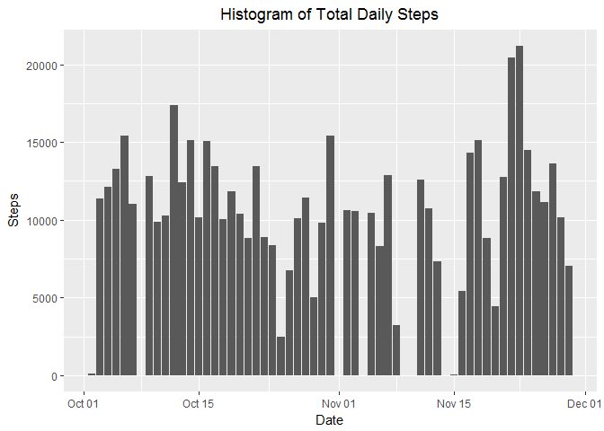
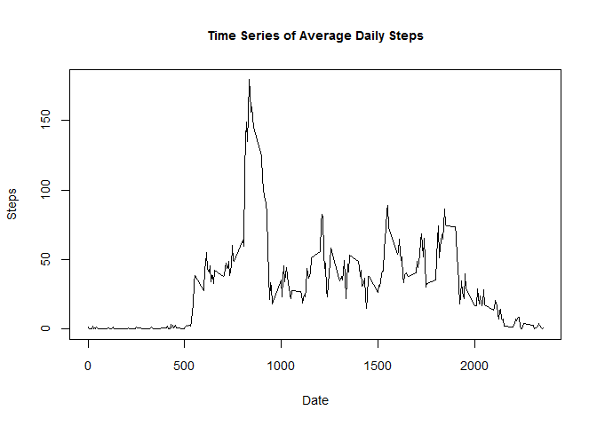
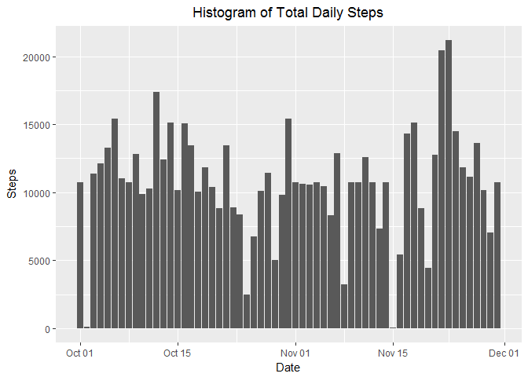
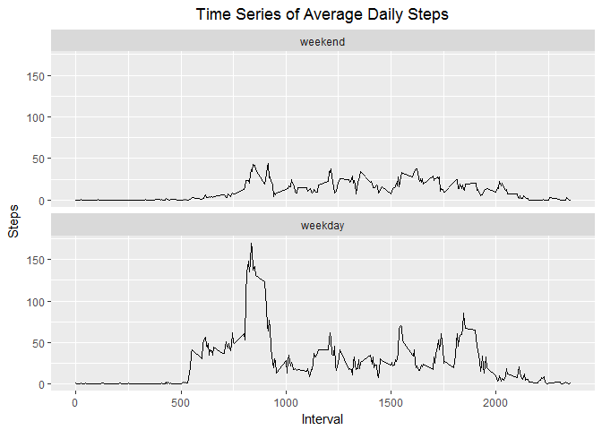

## Loading and preprocessing the data

### 1. Load the data


```r
  activity <- read.csv(file="activity.csv", header=TRUE, as.is=TRUE)
```

### 2. Process/transform the data

```r
  activity$steps <- as.numeric(activity$steps)
  activity$date <- as.Date(activity$date, format = "%Y-%m-%d")
  head(activity)
```

```
##   steps       date interval
## 1    NA 2012-10-01        0
## 2    NA 2012-10-01        5
## 3    NA 2012-10-01       10
## 4    NA 2012-10-01       15
## 5    NA 2012-10-01       20
## 6    NA 2012-10-01       25
```

## What is mean total number of steps taken per day?

### 1. Calculate the total number of steps taken per day


```r
  aggregate(steps ~ date, activity, sum, na.action = na.pass)
```

```
##          date steps
## 1  2012-10-01    NA
## 2  2012-10-02   126
## 3  2012-10-03 11352
## 4  2012-10-04 12116
## 5  2012-10-05 13294
## 6  2012-10-06 15420
## 7  2012-10-07 11015
## 8  2012-10-08    NA
## 9  2012-10-09 12811
## 10 2012-10-10  9900
## 11 2012-10-11 10304
## 12 2012-10-12 17382
## 13 2012-10-13 12426
## 14 2012-10-14 15098
## 15 2012-10-15 10139
## 16 2012-10-16 15084
## 17 2012-10-17 13452
## 18 2012-10-18 10056
## 19 2012-10-19 11829
## 20 2012-10-20 10395
## 21 2012-10-21  8821
## 22 2012-10-22 13460
## 23 2012-10-23  8918
## 24 2012-10-24  8355
## 25 2012-10-25  2492
## 26 2012-10-26  6778
## 27 2012-10-27 10119
## 28 2012-10-28 11458
## 29 2012-10-29  5018
## 30 2012-10-30  9819
## 31 2012-10-31 15414
## 32 2012-11-01    NA
## 33 2012-11-02 10600
## 34 2012-11-03 10571
## 35 2012-11-04    NA
## 36 2012-11-05 10439
## 37 2012-11-06  8334
## 38 2012-11-07 12883
## 39 2012-11-08  3219
## 40 2012-11-09    NA
## 41 2012-11-10    NA
## 42 2012-11-11 12608
## 43 2012-11-12 10765
## 44 2012-11-13  7336
## 45 2012-11-14    NA
## 46 2012-11-15    41
## 47 2012-11-16  5441
## 48 2012-11-17 14339
## 49 2012-11-18 15110
## 50 2012-11-19  8841
## 51 2012-11-20  4472
## 52 2012-11-21 12787
## 53 2012-11-22 20427
## 54 2012-11-23 21194
## 55 2012-11-24 14478
## 56 2012-11-25 11834
## 57 2012-11-26 11162
## 58 2012-11-27 13646
## 59 2012-11-28 10183
## 60 2012-11-29  7047
## 61 2012-11-30    NA
```

### 2. Make a histogram of the total number of steps taken each day


```r
  dailysteps <- aggregate(steps ~ date, activity, sum, na.action=na.pass)
  myplot <- ggplot(data = dailysteps, aes(x=dailysteps$date, y=dailysteps$steps))
  myplot <- myplot + geom_bar(stat = "identity") + labs(title = "Histogram of Total Daily Steps") + theme(plot.title = element_text(hjust = 0.5)) + labs(x = "Date", y = "Steps")
  print(myplot)
```

<!-- -->

### 3. Calculate and report the mean and median of the total number of steps taken per day

### Mean:


```r
  mean(dailysteps$steps, na.rm = TRUE)
```

```
## [1] 10766.19
```

### Median:


```r
  median(dailysteps$steps, na.rm = TRUE)
```

```
## [1] 10765
```

## What is the average daily activity pattern?

### 1. Make a time series plot of the 5-minute interval (x-axis) and the average number of steps taken, averaged across all days (y-axis)


```r
  days <- length(unique(activity$date))
  idailysteps <- aggregate(steps ~ interval, data = activity, function(steps) sum(steps)/days)
  plot(idailysteps$interval, idailysteps$steps, type = "l", main = "Time Series of Average Daily Steps", xlab = "Date", ylab = "Steps", cex.main = 0.9, cex.lab = 0.9, cex.axis = 0.9)
```

<!-- -->

### 2. Which 5-minute interval, on average across all the days in the dataset, contains the maximum number of steps?

```{ r max_steps}
  n <- idailysteps[which.max(idailysteps$steps), ]
  n$interval
```

## Imputing missing values

### 1. Calculate and report the total number of missing values in the dataset (i.e. the total number of rows with NAs)


```r
  sum(is.na(activity$steps))
```

```
## [1] 2304
```

### 2. Devise a strategy for filling in all of the missing values in the dataset. Strategy is to use the mean for that particular interval.


```r
  interval_m <- aggregate(steps ~ interval, data = activity, function(steps) mean(steps, na.rm = TRUE))
```

### 3. Create a new dataset that is equal to the original dataset but with the missing data filled in.


```r
  activity2 <- activity
  activity2[is.na(activity2$steps), ]$steps <- interval_m[interval_m$interval %in% activity2$interval, "steps"]
```

### 4. Make a histogram of the total number of steps taken each day and Calculate and report the mean and median total number of steps taken per day. Do these values differ from the estimates from the first part of the assignment? What is the impact of imputing missing data on the estimates of the total daily number of steps?


```r
  dailysteps2 <- aggregate(steps ~ date, activity2, sum)
  myplot2 <- ggplot(data = dailysteps2, aes(x=dailysteps2$date, y=dailysteps2$steps))
  myplot2 <- myplot2 + geom_bar(stat = "identity") + labs(title = "Histogram of Total Daily Steps") + theme(plot.title = element_text(hjust = 0.5)) + labs(x = "Date", y = "Steps")
  print(myplot2)
```

<!-- -->

### Mean:


```r
  mean(dailysteps2$steps)
```

```
## [1] 10766.19
```

### Median:


```r
  median(dailysteps2$steps)
```

```
## [1] 10766.19
```

### These values are very near to those of the first part of the assignment. Adding missing data has very minimal impact on the estimates of the total daily number of steps.

## Are there differences in activity patterns between weekdays and weekends?

### 1. Create a new factor variable in the dataset with two levels - "weekday" and "weekend" indicating whether a given date is a weekday or weekend day.


```r
  days <- length(unique(activity2$date))
  sub1 <- aggregate(steps ~ interval, data = subset(activity2, is.weekend(activity2$date)), function(steps) sum(steps)/days)
  sub1 <- cbind(sub1, day="weekend")
  sub2 <- aggregate(steps ~ interval, data = subset(activity2, !is.weekend(activity2$date)), function(steps) sum(steps)/days)
  sub2 <- cbind(sub2, day="weekday")
  sub3 <- rbind(sub1, sub2)
```

### 2. Make a panel plot containing a time series plot of the 5-minute interval (x-axis) and the average number of steps taken, averaged across all weekday days or weekend days (y-axis).


```r
  plot1 <- ggplot(sub3, aes(x = interval, y = steps))
  plot1 <- plot1 + labs(title = "Time Series of Average Daily Steps") + theme(plot.title = element_text(hjust = 0.5)) + labs(x = "Interval", y = "Steps") + facet_wrap(~day, ncol=1) + geom_line()
  print(plot1)
```

<!-- -->
